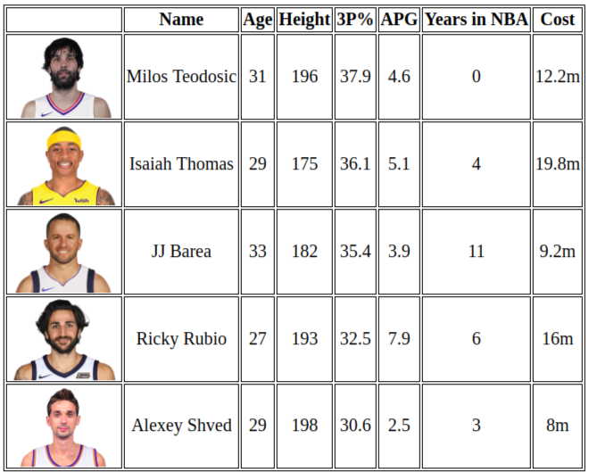
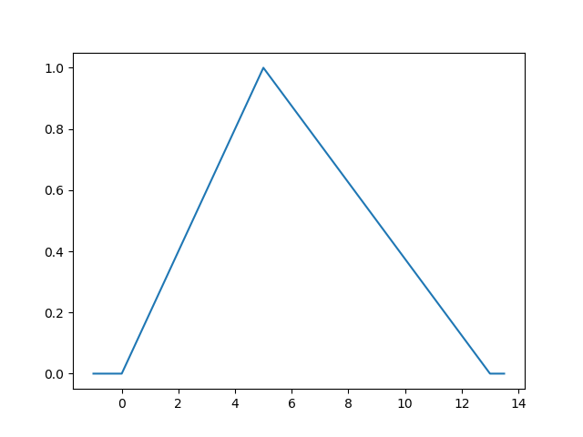
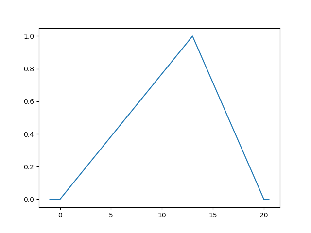
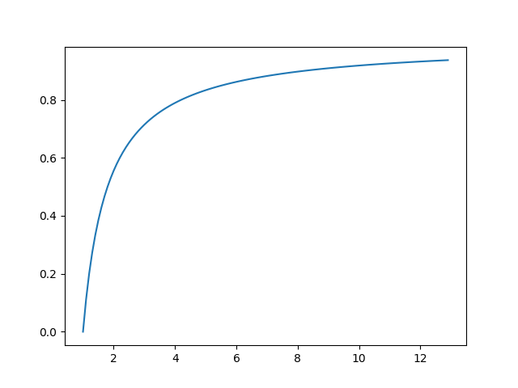
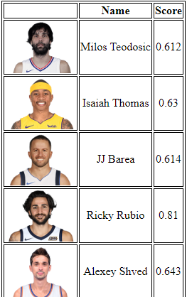

# Installation
	composer require ketili/fuzzydm
    
    
# Introduction

This is a small PHP library to make multi criteria decisions. It is depended on fuzzy-logic fundamentals and uses simple [membership](https://bit.ly/2NLJIrs) and [agregate](https://en.wikipedia.org/wiki/Aggregate_function) functions. Using this library you can make decisions based on some predefined numeric features. For example, you are manager of some basketball team and you want to make profitable guard transfer for the team and you have some specific requirements: you have limited transfer budget, have some range of weight, age or height, need maximally experienced and young player as possible. This example will be discussed above alongside with library methods and functions.

 # Example
 
Let's imagine that we have following list of guards with their characteristics:

**1. Age**

You need an young player, so what is a aproximately good age for being young and also experienced a little bit? I think 24, 25 or 26... or some age nearer those numbers. Let's make membership function to express your requirement. Would be better if we use trapezoid membership function which actually looks like:

where a, b, c and d are numeric parameters, indicating corners of trapezoid-shaped graph. If we take a, b, c and d consecutively 18, 24, 26, 35 we would get graph like that: 

it means that ideal option for us is age between [24, 26] where function returns 1. Also return value decreasing  when argument approaches to 18 and 35 as shown on graph. It means that you don't need 18 year old player who doesn't have any experience, also you don't need older than 35, it is too old for your team. For example this function estimates 30 old player as 0.55

**2.Years in NBA**

Here we use _triangular membership function_ 

where a, b and c are numeric params indicating corners of triangle-shaped graph: 

in this graph **a = 0, b = 5, c = 13** and it means that your favorite option would be player with 5 years of NBA experience.  

**3. Cost**

You just have 20 million dollars and you want to not waste all your money but also you don't need to buy cheap player, because in trademarket cost means player efficiency. So let's use **triangular function again with parameters a = 0, b = 13 and c = 20**

**4.Height**

Of course point guards are not too tall because they should be quick, could move ball fast da have good dribbling skills. There is snippet from wikipedia:

> In the NBA, point guards are usually about 6' 3" (1.93 m) or shorter, and average about 6' 2" (1.88 m) whereas in the WNBA, point guards are usually 5' 9" (1.75 m) or shorter. Having above-average size (height, muscle) is considered advantageous, although size is secondary to situational awareness, speed, quickness, and ball handling skills.

Lets take **triangular** again, **a = 160, b = 188, c = 205**

**5. Assists per game (APG)**

Here we choose some non fundamental, **custom membership function** which has horizontal asymptote on y=1

this means that function has value 0 at point x = 1 and it increases monotonously by increasing **x** and never becomes equal to 1 because function has asympote **y = 1**. Here is a formula of this graph:

**6. Three point percentage (3P%)**

We should take same type of function here but with different parameters:

## Aggregation

Lets calculate values of membership functions for example for **JJ Barea**:

so we have evaluations for each characteritic of player and we need to aggregate them into single evaluation. Here is many [aggregate functions](https://en.wikipedia.org/wiki/Aggregate_function), but for simplicity we can just use most famous aggregate function - [Arithmetic Mean](https://en.wikipedia.org/wiki/Arithmetic_mean)

So aggregated evaluation of **JJ Barea** would be:

and full table of evaluations looks like that: 

# Implementation

First of all lets declare features of basketball player:

    $age = new Feature('age', new Trapmf(18, 24, 26, 35));
    $nbaYears = new Feature('nba_years', new Trimf(0, 5, 13));
    $cost = new Feature('cost', new Trimf(0, 13, 20));
    $height = new Feature('height', new Trimf(160, 188, 205));

this library already contains implementations of _triangular_ and _trapezoid_ membership functions so this classes are used in this code. But as we described above we have two custom functions with horizontal asymptotes for _APG_ and _3P%_. So we can create our custom membership functions, by just implementing _MembershipFunction_ interface:

    class Assists implements MembershipFunction
    {
        function call($x)
        {
            $x = (float)$x;

            return ($x - 1) / ($x - 0.2);

        }
    }

    class TPP implements MembershipFunction
    {
    
        function call($x)
        {
            $x = (float)$x;
    
            return ($x - 20) / ($x - 19);
        }
    }

and declare relevant features too:

    $assistsPerGame = new Feature('apg', new Assists());
    $threePointPercentage = new Feature('3pp', new TPP());
    
make array of features:

    $features = array(
        $age,
        $nbaYears,
        $cost,
        $height,
        $assistsPerGame,
        $threePointPercentage
    );
 
array of guards:

    $guards = array(
        new Item($identifier = 'Milos Teodosic',
            $feature_values = array(
                'age' => 31,
                'height' => 196,
                '3pp' => 37.9,
                'apg' => 4.6,
                'nba_years' => 0,
                'cost' => 12.2
            )),
        new Item($identifier = 'Isaiah Thomas',
            $feature_values = array(
                'age' => 29,
                'height' => 175,
                '3pp' => 36.1,
                'apg' => 5.1,
                'nba_years' => 4,
                'cost' => 19.8
            )),
        new Item($identifier = 'JJ Barea',
            $feature_values = array(
                'age' => 33,
                'height' => 182,
                '3pp' => 35.4,
                'apg' => 3.9,
                'nba_years' => 11,
                'cost' => 9.2
            )),
        new Item($identifier = 'Ricky Rubio',
            $feature_values = array(
                'age' => 27,
                'height' => 193,
                '3pp' => 32.5,
                'apg' => 7.9,
                'nba_years' => 6,
                'cost' => 16
            )),
        new Item($identifier = 'Alexey Shved',
            $feature_values = array(
                'age' => 29,
                'height' => 198,
                '3pp' => 30.6,
                'apg' => 2.5,
                'nba_years' => 3,
                'cost' => 8
            ))
    );

and analyze this data:

    $analyzer = new Analyzer($features, $guards, new ArithmeticMean());
    $analyzer->analyze();
    $sorted = $analyzer->sort();

echo output:

    foreach ($sorted as $item)
    {
        echo $item->item_identifier." - ".$item->score."\n";
    }

_OUTPUT:_

    
    Ricky Rubio - 0.81053827254808
    Alexey Shved - 0.64329716740423
    Isaiah Thomas - 0.6348679237777
    JJ Barea - 0.61473949827608
    Milos Teodosic - 0.61293158548061

## Priorities... Weights...

It is so expectable that we may don't want that all our features had the same importance. For example you may need player just for one season and player's age is not considerable, but not too insignificant. So we can set weights between [0,1] to our features. Lets do it and check out how output changes after setting **weights**;

    $age->set_weight(0.4);
    $nbaYears->set_weight(0.2);
    $height->set_weight(0.8);
    $cost->set_weight(1);
    $assistsPerGame->set_weight(0.71);
    $threePointPercentage->set_weight(0.77);

and we are getting: 

	Ricky Rubio - 0.78430304749612
	Milos Teodosic - 0.68180312874937
	JJ Barea - 0.67695882586768
	Alexey Shved - 0.64070029059168
	Isaiah Thomas - 0.58441672648242

it seems that Ricky Rubio is uncompetitively good for us according to our requirements and priorities, but after setting priorities, changed sequence after Rubio, Milos Teodosic became second most desirable player after Rubio.

# Feedbacks and Pull Requests

Any kind of pull requests will be acceptable. 

**note:**  _There are few amount of membership and aggregate functions and I think most desirable pull requests would be about them_

# C# version:

[https://github.com/goodot/fuzzy-decision-maker](https://github.com/goodot/fuzzy-decision-maker)

(not finished yet)
